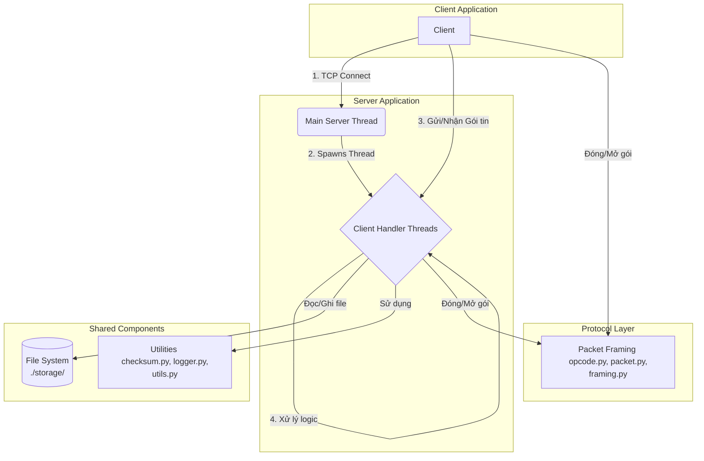

# Đồ án Mạng máy tính: Hệ thống truyền nhận file qua Socket

Dự án này mô phỏng một dịch vụ chia sẻ file nội bộ, xây dựng một ứng dụng client-server hoàn chỉnh bằng Python, sử dụng giao thức TCP và một giao thức tùy chỉnh ở tầng ứng dụng.

## Mục tiêu kỹ thuật

- **Socket API tầng TCP**: Sử dụng các hàm socket cơ bản để tạo kết nối.
- **Message Boundary**: Tự thiết kế cơ chế đóng khung (framing) để giải quyết vấn đề của giao thức stream.
- **Thiết kế giao thức**: Xây dựng giao thức tầng ứng dụng tùy chỉnh có cấu trúc nhị phân rõ ràng.
- **I/O đồng thời**: Server có khả năng phục vụ nhiều client cùng lúc bằng cách sử dụng `threading`.
- **Tính toàn vẹn & chịu lỗi**: Đảm bảo file được truyền đúng và đủ bằng checksum, đồng thời xử lý các lỗi phát sinh như mất kết nối.

## Kiến trúc hệ thống

Sơ đồ dưới đây mô tả kiến trúc tổng quan của hệ thống, bao gồm các thành phần chính và luồng tương tác giữa chúng.



**Luồng hoạt động chính:**
1.  **Server** khởi động luồng chính (`Main Server Thread`) để lắng nghe kết nối mới trên một cổng xác định.
2.  Khi một **Client** thực hiện kết nối, luồng chính của Server chấp nhận và tạo ra một luồng xử lý riêng (`Client Handler Thread`) để phục vụ riêng cho client đó.
3.  **Client** và **Client Handler** tương ứng giao tiếp với nhau bằng cách gửi và nhận các gói tin (`Packet`) theo một giao thức tùy chỉnh.
4.  **Lớp Giao thức** (`Protocol Layer`) chịu trách nhiệm đóng gói (`pack`) dữ liệu thành `Packet` trước khi gửi và giải mã (`unpack`) `Packet` khi nhận. Nó cũng xử lý vấn đề `message boundary` bằng kỹ thuật `length-prefixed framing`.
5.  **Client Handler** dựa vào `opcode` trong gói tin để thực hiện các yêu cầu của client (ví dụ: `LOGIN`, `FILE_UPLOAD`).
6.  Trong quá trình xử lý, `Client Handler` tương tác với **Hệ thống file** (`File System`) để lưu/đọc file trong thư mục `storage/<username>` và sử dụng các **Tiện ích** (`Utilities`) như ghi log, tính checksum.

## Cấu trúc thư mục

```
FileTransfer/
├── logs/                   # Thư mục chứa file log
│   └── server.log
├── storage/                # Thư mục server lưu file của các user
│   └── <username>/
├── protocol/               # Module định nghĩa giao thức tùy chỉnh
│   ├── __init__.py
│   ├── opcode.py           # Định nghĩa các mã lệnh (opcode)
│   ├── packet.py           # Định nghĩa cấu trúc gói tin
│   └── framing.py          # Xử lý đóng khung (gửi/nhận toàn vẹn 1 gói tin)
├── common/                 # Các module tiện ích chung
│   ├── __init__.py
│   ├── checksum.py         # Hàm tính checksum cho file
│   ├── logger.py           # Module thiết lập ghi log
│   └── utils.py            # Các hàm tiện ích khác
├── client.py               # Chương trình client
├── server.py               # Chương trình server
├── config.py               # File cấu hình (HOST, PORT, ...)
├── README.md               # File mô tả dự án
```

## Giao thức tùy chỉnh

Mỗi gói tin được truyền trên mạng đều tuân theo cấu trúc `Length-Opcode-Payload`.

- **Cấu trúc gói tin**: `[LENGTH (4 bytes)][OPCODE (2 bytes)][USER_ID (2 bytes)][PAYLOAD (variable)]`
- **`LENGTH`**: Số nguyên 4-byte (big-endian) cho biết tổng kích thước của phần còn lại của gói tin (`OPCODE` + `USER_ID` + `PAYLOAD`).
- **`OPCODE`**: Mã lệnh 2-byte xác định loại yêu cầu/phản hồi.
- **`USER_ID`**: ID của người dùng.
- **`PAYLOAD`**: Dữ liệu đi kèm, có cấu trúc thay đổi tùy theo `OPCODE`.

## Hướng dẫn chạy

1.  **Chạy Server**

    Mở terminal và thực thi lệnh:
    ```bash
    python server.py
    ```
    Server sẽ bắt đầu lắng nghe kết nối tại địa chỉ và cổng được định nghĩa trong `config.py`.

2.  **Chạy Client**

    Mở một terminal khác. Để đăng nhập, sử dụng lệnh:
    ```bash
    python client.py login <username> <user_id>
    ```
    Ví dụ:
    ```bash
    python client.py login alice 101
    ```

---