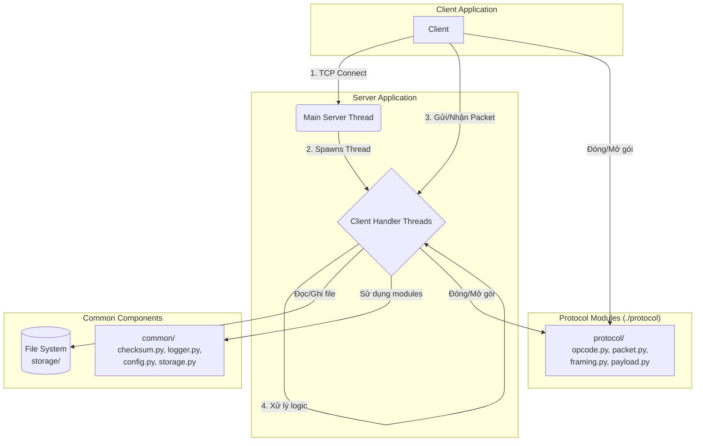

# Đồ án Mạng máy tính: Hệ thống truyền nhận file qua Socket

Dự án này mô phỏng một dịch vụ chia sẻ file nội bộ, xây dựng một ứng dụng client-server hoàn chỉnh bằng Python, sử dụng giao thức TCP và một giao thức tùy chỉnh ở tầng ứng dụng.

## Mục tiêu kỹ thuật

- **Socket API tầng TCP**: Sử dụng các hàm socket cơ bản để tạo kết nối.
- **Message Boundary**: Tự thiết kế cơ chế đóng khung (framing) để giải quyết vấn đề của giao thức stream.
- **Thiết kế giao thức**: Xây dựng giao thức tầng ứng dụng tùy chỉnh có cấu trúc nhị phân rõ ràng.
- **I/O đồng thời**: Server có khả năng phục vụ nhiều client cùng lúc bằng cách sử dụng `threading`.
- **Tính toàn vẹn & chịu lỗi**: Đảm bảo file được truyền đúng và đủ bằng checksum, đồng thời xử lý các lỗi phát sinh như mất kết nối.

## Tổng quan chức năng

Hệ thống cung cấp các chức năng cốt lõi của một dịch vụ lưu trữ và chia sẻ file cơ bản:

-   **Xác thực người dùng**: Client đăng nhập vào hệ thống bằng `username` và `user_id`. Mỗi người dùng có một không gian lưu trữ riêng trên server.
-   **Quản lý file từ xa**:
    -   **Liệt kê file (`list`)**: Xem danh sách các file đã có trên server.
    -   **Tải file lên (`upload`)**: Tải một file từ máy local lên server.
    -   **Tải file xuống (`download`)**: Tải một file từ server về máy local.
    -   **Xóa file (`delete`)**: Xóa một file khỏi server.
-   **Phục hồi truyền file (Resume)**: Cả quá trình upload và download đều có khả năng tự động phục hồi nếu bị gián đoạn, giúp tiết kiệm thời gian và băng thông.
-   **Giới hạn băng thông (Rate Limiting)**: Có thể cấu hình tốc độ upload/download tối đa để kiểm soát việc sử dụng tài nguyên mạng.
-   **Hỗ trợ nhiều người dùng**: Server được thiết kế để phục vụ nhiều client kết nối và hoạt động đồng thời.

## Kiến trúc hệ thống

Sơ đồ dưới đây mô tả kiến trúc tổng quan của hệ thống, bao gồm các thành phần chính và luồng tương tác giữa chúng.



**Luồng hoạt động chính:**
1.  **Server** khởi động luồng chính (`Main Server Thread`) để lắng nghe kết nối mới trên một cổng xác định.
2.  Khi một **Client** thực hiện kết nối, luồng chính của Server chấp nhận và tạo ra một luồng xử lý riêng (`Client Handler Thread`) để phục vụ riêng cho client đó.
3.  **Client** và **Client Handler** tương ứng giao tiếp với nhau bằng cách gửi và nhận các gói tin (`Packet`) theo một giao thức tùy chỉnh.
4.  Các **Module Giao thức** (`Protocol Modules`) chịu trách nhiệm đóng gói (`pack`) dữ liệu thành `Packet` trước khi gửi và giải mã (`unpack`) `Packet` khi nhận. Nó cũng xử lý vấn đề `message boundary` bằng kỹ thuật `length-prefixed framing`.
5.  **Client Handler** dựa vào `opcode` trong gói tin để thực hiện các yêu cầu của client (ví dụ: `LOGIN`, `FILE_UPLOAD`).
6.  Trong quá trình xử lý, `Client Handler` tương tác với **Hệ thống file** (`File System`) để lưu/đọc file trong thư mục `storage/<username>` và sử dụng các **Module chung** (`common/`) như ghi log, tính checksum.

## Cấu trúc thư mục

```
FileTransfer/
├── logs/                   # Thư mục chứa file log
│   └── server.log
│
├── interface_server/       # Giao diện server
│   ├── storage/            # Thư mục server lưu file của các user
│   │   └── <username>/
│   └── user_info.csv       # File lưu thông tin user
│
├── interface_client/       # Giao diện client
│   └── login_state.json    # File lưu trạng thái đăng nhập
│
├── protocol/               # Module định nghĩa giao thức tùy chỉnh
│   ├── opcode.py           # Định nghĩa các mã lệnh (opcode)
│   ├── packet.py           # Định nghĩa cấu trúc gói tin
│   ├── framing.py          # Xử lý đóng khung (gửi/nhận toàn vẹn 1 gói tin)
│   └── payload.py          # Encode/decode dữ liệu trong gói tin
│
├── common/                 # Các module tiện ích chung
│   ├── checksum.py         # Hàm tính checksum cho file
│   ├── config.py           # File cấu hình (HOST, PORT, ...)
│   ├── logger.py           # Module thiết lập ghi log
│   └── storage.py          # Module lưu trữ file
│
├── file_transfer/          # Module xử lý truyền file
│   └── file_transfer.py
│
├── client.py               # Chương trình client
└── server.py               # Chương trình server
```

## Cơ chế kỹ thuật

### 1. Xử lý Message Boundary với Length-Prefixed Framing

- **Cơ chế**: Dự án sử dụng kỹ thuật **Length-Prefixed Framing**. Trước khi gửi một gói tin logic, hệ thống sẽ tính toán tổng kích thước của nó và gửi con số này đi trước dưới dạng một tiêu đề có độ dài cố định (4-byte `LENGTH`).
- **Luồng hoạt động**:
    1.  **Bên gửi**: Đóng gói dữ liệu vào `Packet`, tính tổng kích thước (`OPCODE` + `USER_ID` + `PAYLOAD`), sau đó gửi `[LENGTH (4 bytes)][Packet]` qua socket.
    2.  **Bên nhận**: Trước tiên, đọc chính xác 4 byte đầu tiên để biết được kích thước `LENGTH` của gói tin đang chờ. Sau đó, tiếp tục đọc từ socket cho đến khi nhận đủ `LENGTH` byte. Tại thời điểm này, bên nhận chắc chắn đã có một gói tin hoàn chỉnh và có thể bắt đầu xử lý nó.- **Lý do lựa chọn**:
    - **Đơn giản và hiệu quả**: Đây là một trong những phương pháp tiêu chuẩn và hiệu quả nhất để giải quyết vấn đề message boundary trên TCP.
    - **An toàn với dữ liệu nhị phân**: So với việc dùng ký tự phân tách (delimiter), phương pháp này an toàn tuyệt đối vì nó không quan tâm đến nội dung của payload. Một ký tự phân tách có thể vô tình xuất hiện trong dữ liệu file nhị phân, gây lỗi nghiêm trọng.

### 2. Định dạng Packet, Opcode và Payload

Mỗi gói tin được truyền trên socket có cấu trúc tổng quát:

```text
[LENGTH: 4 bytes][OPCODE: 2 bytes][USER_ID: 2 bytes][PAYLOAD: variable]
```

Trong đó:
- `LENGTH`: độ dài của toàn bộ `Packet` phía sau, tức `OPCODE + USER_ID + PAYLOAD`. Trường này thuộc lớp framing để xử lý TCP stream, không nằm trong đối tượng `Packet`.
- `OPCODE`: mã lệnh xác định loại thao tác logic.
- `USER_ID`: định danh người dùng sau khi đăng nhập. Trước khi đăng nhập, client gửi `USER_ID = 0`.
- `PAYLOAD`: dữ liệu nhị phân thay đổi theo từng opcode. Nếu packet không cần dữ liệu bổ sung thì payload rỗng (`b""`).

Để thống nhất cơ chế phản hồi, hệ thống không tạo opcode riêng cho từng loại response. Khi xử lý thành công một yêu cầu, server gửi packet ngoài có `OPCODE = ACK`; payload của `ACK` có thể chứa một packet con đã được `pack()` để biểu diễn phản hồi cho đúng opcode gốc. Ví dụ, phản hồi cho `LOGIN` là `ACK(payload = Packet(LOGIN, user_id, ...).pack())`, phản hồi cho `FILE_LIST` là `ACK(payload = Packet(FILE_LIST, user_id, danh_sach_file).pack())`.

| Opcode | Giá trị | Hướng | Ý nghĩa | Định dạng payload |
|---|---:|---|---|---|
| `LOGIN` | `0x01` | Client→Server | Đăng nhập bằng username | Chuỗi UTF-8: `username` |
| `LOGIN` | `0x01` | Server→Client | Trả về User ID | Rỗng (User ID được đặt trong header) |
| `LOGOUT` | `0x02` | Client→Server | Đăng xuất người dùng hiện tại | Rỗng |
| `FILE_LIST` | `0x10` | Client→Server | Yêu cầu danh sách file của user | Rỗng |
| `FILE_LIST` | `0x10` | Server→Client | Trả về danh sách file của user | Chuỗi UTF-8, các tên file phân tách bằng `\n`, có thể rỗng nếu chưa có file |
| `FILE_UPLOAD` | `0x12` | Client→Server | Khởi tạo upload file | Metadata file: `[filename_len: 2 bytes][filename: UTF-8][total_size: 8 bytes][checksum_len: 2 bytes][checksum: ASCII]` |
| `FILE_UPLOAD` | `0x12` | Server→Client | Xác nhận bắt đầu upload và cho biết offset để resume | `[offset: 8 bytes]`, big-endian |
| `FILE_DOWNLOAD` | `0x13` | Client→Server | Yêu cầu tải file | Chuỗi UTF-8 `remote_filename` |
| `FILE_DOWNLOAD` | `0x13` | Server→Client | Trả metadata trước khi gửi chunk | Metadata file `[filename_len: 2 bytes][filename: UTF-8][total_size: 8 bytes][checksum_len: 2 bytes][checksum: ASCII]` |
| `FILE_CHUNK` | `0x14` | Hai chiều | Truyền một phần dữ liệu file | `[offset: 8 bytes][chunk_data: bytes]`, trong đó `offset` là vị trí bắt đầu của chunk trong file |
| `FILE_DELETE` | `0x15` | Client→Server | Xóa file trên server | Chuỗi UTF-8: `remote_filename` |
| `ACK` | `0x20` | Server→Client | Xác nhận thao tác thành công hoặc bọc packet phản hồi | Thường là `Packet(opcode_gốc, user_id, response_payload).pack()`. Một số ACK hoàn tất đơn giản dùng chuỗi UTF-8 như `logout`, `uploaded:<filename>:sha256:<checksum>` hoặc `deleted:<filename>` |
| `ERROR` | `0xFF` | Server→Client | Báo lỗi xử lý yêu cầu | Chuỗi UTF-8 mô tả lỗi |

Các số nguyên trong header và payload nhị phân được mã hóa theo dạng big-endian. Với cách thiết kế này, opcode gốc luôn đại diện cho thao tác logic (`LOGIN`, `FILE_LIST`, `FILE_DOWNLOAD`, ...), còn `ACK` chỉ đóng vai trò xác nhận và mang dữ liệu phản hồi nếu cần.

### 3. Đảm bảo Toàn vẹn File với Checksum SHA-256

- **Vấn đề**: Trong quá trình truyền qua mạng, dữ liệu file có thể bị thay đổi hoặc mất mát do lỗi đường truyền, dẫn đến file bị hỏng ở phía người nhận.
- **Cơ chế**:
    1.  **Bên gửi (Client)**: Trước khi bắt đầu upload, client tính toán giá trị băm (hash) của toàn bộ file bằng thuật toán **SHA-256**. Giá trị hash này (gọi là `checksum`) được gửi đến server cùng với các siêu dữ liệu khác (tên file, kích thước).
    2.  **Bên nhận (Server)**: Sau khi nhận tất cả các chunk của file, server cũng tính toán lại checksum SHA-256 trên file vừa nhận được.
    3.  **Xác thực**: Server so sánh checksum mà nó tính được với checksum mà client đã gửi. Nếu hai giá trị khớp nhau, file đã được truyền thành công và toàn vẹn. Nếu không, server sẽ báo lỗi.
- **Lý do lựa chọn**:
    - **Độ tin cậy cao**: SHA-256 là một thuật toán băm mật mã học. Khả năng hai file khác nhau tạo ra cùng một giá trị hash (xung đột - collision) là cực kỳ thấp, đảm bảo việc phát hiện lỗi gần như tuyệt đối.
    - **Hiệu quả với file lớn**: Việc tính checksum được thực hiện bằng cách đọc file theo từng chunk nhỏ, giúp ứng dụng không tiêu tốn quá nhiều bộ nhớ, ngay cả khi xử lý các file có dung lượng hàng gigabyte.

### 3. Giới hạn băng thông (Rate Limiting)

-   **Vấn đề**: Một phiên truyền file (upload/download) có thể chiếm toàn bộ băng thông mạng có sẵn của client hoặc server, làm ảnh hưởng đến các tác vụ khác và gây ra trải nghiệm không tốt.
-   **Cơ chế**:
    1.  Hệ thống sử dụng một lớp `RateLimiter` để thực hiện việc điều tiết tốc độ.
    2.  Trước khi bắt đầu một phiên truyền file, một đối tượng `RateLimiter` được tạo ra với tốc độ tối đa được cấu hình trong `config.py` (`CLIENT_UPLOAD_RATE_KBPS` cho client và `SERVER_UPLOAD_RATE_KBPS` cho server).
    3.  Đối tượng này được truyền vào hàm `send_file_chunks` và sau đó là `send_packet`.
    4.  Sau mỗi lần gửi một gói tin (chunk), `RateLimiter` sẽ tính toán lượng dữ liệu đã gửi và thời gian đã trôi qua. Nếu tốc độ hiện tại vượt quá giới hạn, nó sẽ cho luồng hiện tại "ngủ" (`time.sleep()`) một khoảng thời gian ngắn để hãm tốc độ trung bình lại.
-   **Lý do lựa chọn**:
    -   **Đơn giản và hiệu quả**: Đây là một cách triển khai thuật toán "token bucket" ở mức cơ bản, dễ hiểu và không cần thư viện bên ngoài.
    -   **Kiểm soát linh hoạt**: Cho phép cấu hình các giới hạn tốc độ khác nhau cho việc upload của client và download từ server, phù hợp với các mô hình mạng bất đối xứng phổ biến.
    -   **Áp dụng trên từng kết nối**: Việc giới hạn được áp dụng riêng cho mỗi phiên truyền file, giúp đảm bảo sự công bằng giữa các client đang hoạt động đồng thời.

### 4. Lựa chọn các tham số hệ thống

Các hằng số trong `config.py` được chọn dựa trên sự cân bằng giữa hiệu năng, tài nguyên và trải nghiệm người dùng.

-   **`CHUNK_SIZE = 4096` (4KB)**
    -   **Lý do**: Đây là một kích thước phổ biến cho các khối (block) trong hệ thống file và trang bộ nhớ (memory page).
    -   **Cân bằng**:
        -   **Nếu quá nhỏ**: Sẽ làm tăng gánh nặng (overhead) do mỗi chunk phải được gói trong một packet riêng, dẫn đến nhiều lệnh gọi hệ thống và header mạng hơn.
        -   **Nếu quá lớn**: Sẽ chiếm nhiều bộ nhớ đệm và có thể làm cho việc giới hạn băng thông (rate limiting) kém chính xác hơn, cũng như khiến thanh tiến trình (progress bar) cập nhật không mượt mà.
    -   **Kết luận**: 4KB là một giá trị cân bằng, hiệu quả cho hầu hết các điều kiện mạng thông thường.

-   **`SERVER_UPLOAD_RATE_KBPS = 1024` và `CLIENT_UPLOAD_RATE_KBPS = 512`**
    -   **Lý do**: Các giá trị này được đặt ra để minh họa cho tính năng giới hạn băng thông và đảm bảo sự công bằng giữa các client.
    -   **`SERVER_UPLOAD_RATE_KBPS` (1MB/s)**: Giới hạn tốc độ server gửi dữ liệu (client download). Mức này đủ nhanh để mang lại trải nghiệm tốt nhưng cũng đủ thấp để một client không chiếm hết toàn bộ băng thông của server.
    -   **`CLIENT_UPLOAD_RATE_KBPS` (512KB/s)**: Giới hạn tốc độ client gửi dữ liệu. Mức này thấp hơn vì trong thực tế, băng thông upload của người dùng thường hạn chế hơn download. Việc giới hạn giúp client không bị "treo" các tác vụ mạng khác.

-   **`MAX_CONCURRENT_CLIENTS = 50`**
    -   **Lý do**: Đây là một biện pháp quản lý tài nguyên để ngăn server bị quá tải. Mỗi client kết nối sẽ tiêu tốn một luồng (thread), bộ nhớ và một file descriptor.
    -   **Cân bằng**: Con số 50 là một ước tính an toàn cho một server chạy trên một máy tính thông thường. Nếu đặt quá cao, server có thể cạn kiệt bộ nhớ hoặc CPU do phải chuyển đổi ngữ cảnh liên tục giữa các luồng. Nếu quá thấp, server sẽ không tận dụng hết tài nguyên.
    -   **Kết luận**: Giá trị này nên được điều chỉnh tùy theo cấu hình phần cứng của server và khối lượng công việc dự kiến.

## Quy tắc hệ thống

### 1. Xử lý File không hợp lệ
Cơ chế này đảm bảo tính nhất quán và an toàn cho dữ liệu trên server.
- **Khi Upload**:
    - **File đã tồn tại**: Server sẽ từ chối upload nếu file trên server có kích thước lớn hơn hoặc bằng file client đang gửi. Nếu file trên server nhỏ hơn, cơ chế upload tiếp (resume) sẽ được kích hoạt.
    - **Lỗi toàn vẹn dữ liệu**: Sau khi nhận xong file, server sẽ tính toán và so sánh `checksum SHA-256`. Nếu không khớp với giá trị client gửi, server sẽ báo lỗi cho client và quá trình upload xem như thất bại.
- **Khi Download hoặc Xóa**:
    - **File không tồn tại**: Nếu client yêu cầu một file không có trong kho lưu trữ của mình, server sẽ gửi lại thông báo lỗi "File not found".

### 2. Xử lý khi vượt giới hạn Client
Cơ chế này giúp server hoạt động ổn định, không bị quá tải bởi quá nhiều kết nối đồng thời.
- **Cơ chế**: Server sử dụng một `Semaphore` để giới hạn số lượng client kết nối cùng lúc, được cấu hình bởi `MAX_CONCURRENT_CLIENTS`.
- **Luồng xử lý**:
    1. Khi có kết nối mới, server sẽ kiểm tra xem `Semaphore` còn "suất" trống hay không.
    2. Nếu hết suất: Kết nối sẽ bị từ chối ngay lập tức. Server gửi một gói tin lỗi "Server at full capacity" và đóng kết nối.
    3. Nếu còn suất: Kết nối được chấp nhận và một luồng xử lý riêng được tạo ra để phục vụ client.
    4. Khi client ngắt kết nối, "suất" sẽ được trả lại cho `Semaphore`, cho phép một client khác kết nối.

## Kiểm chứng chức năng

### File đã dùng và ảnh minh chứng

Giới hạn băng thông tại thời điểm kiểm thử là 512KB/s đối với client's upload và 1024MB/s đối với server's download.

- **File nhỏ**: `\test\1KB.pdf`

    Upload lần 1:
    
    
    Download lần 1:
    

- **File vừa**: `\test\10MB.pdf`

    Upload lần 1:
    
    
    Download lần 1:
    

- **File lớn**: `\test\100MB.pdf`

    Upload lần 1:
    
    
    Download lần 1:
    

    Upload lần 2:
    
    
    Download lần 2:
    

    Upload lần 3:
    
    
    Download lần 3:
    

### Bảng kiểm chứng
| Phân loại File | Hướng truyền | Lần kiểm thử | Thời gian truyền (s) | Tốc độ truyền | CPU trung bình (%) | RAM trung bình (MB) |
|---|---|---|---|---|---|---|
| File nhỏ (1KB)   | Upload   | Lần 1 | 0.004   s | 315.86  KB/s | 4%  | 32 MB |
|                  | Download | Lần 1 | 0.001   s | 1541.76 KB/s | 4%  | 32 MB |
| File vừa (10MB)  | Upload   | Lần 1 | 14.804  s | 691.99  KB/s | 24% | 32 MB |
|                  | Download | Lần 1 | 7.837   s | 1307.24 KB/s | 48% | 32 MB |
| File lớn (100MB) | Upload   | Lần 1 | 154.264 s | 664.51  KB/s | 24% | 32 MB |
|                  | Upload   | Lần 2 | 154.560 s | 663.24  KB/s | 24% | 32 MB |
|                  | Upload   | Lần 3 | 154.957 s | 661.54  KB/s | 24% | 32 MB |
|                  | Download | Lần 1 | 86.326  s | 1187.48 KB/s | 48% | 32 MB |
|                  | Download | Lần 2 | 86.273  s | 1188.20 KB/s | 48% | 32 MB |
|                  | Download | Lần 3 | 86.243  s | 1188.62 KB/s | 48% | 32 MB |
| **Trung bình**   | Upload   |       | 154.594 s | 663.10  KB/s | 24% | 32 MB |
|                  | Download |       | 86.281  s | 1188.10 KB/s | 48% | 32 MB |

### Kết luận

Theo số liệu trung bình:
- Upload: 663.10 KB/s so với giới hạn 512 KB/s
    - Chênh lệch: $(663.10 - 512) / 512 × 100 ≈ 29.5%$
    - Tức là đạt khoảng 129.5% so với mức giới hạn.
- Download: 1188.10 KB/s so với giới hạn 1024 KB/s
    - Chênh lệch: $(1188.10 - 1024) / 1024 × 100 ≈ 16.0%$
    - Tức là đạt khoảng 116.0% so với mức giới hạn.

→ Kết luận: Hiệu suất này là rất tốt, cho thấy hệ thống hoạt động ổn định, khai thác băng thông hiệu quả và đáp ứng tốt mục tiêu đề ra.

Ngoài ra, khả năng xử lý đồng thời nhiều client và đảm bảo tính toàn vẹn dữ liệu của hệ thống được kiểm chứng tại https://tinyurl.vn/yCTT

## Hướng dẫn chạy

1.  **Chạy Server**

    Mở terminal và thực thi lệnh:
    ```bash
    python server.py
    ```
    Server sẽ bắt đầu lắng nghe kết nối tại địa chỉ và cổng được định nghĩa trong `config.py`.

2.  **Chạy Client**

    Mở một terminal khác. Để đăng nhập, sử dụng lệnh:
    ```bash
    python client.py login <username> [--interactive]
    ```
    Ví dụ:
    ```bash
    python client.py login quan --interactive
    ```
